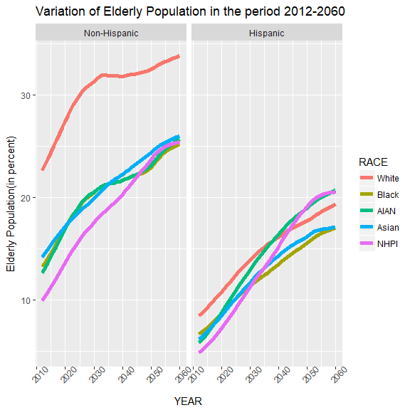

  

#Exploratory Analysis For Population Projection Data
  
##Introduction
  
 The Population Projections Program produces projections of the United States resident population by age, sex, race, and Hispanic origin. The 2012 National Projections are based on the July 1, 2011 population estimates, which are based on the 2010 Census, and provide projections of the population for July 1, 2012 to July 1, 2060. The projections were produced using a cohort-component method and are based on assumptions about future births, deaths, and net international migration. The Census Bureau releases new national projections periodically. Please refer to  
 https://www.census.gov/data/datasets/2012/demo/popproj/2012-popproj.html for details.


  


First, we load the population projections data, and define a new variable, ```population_proj_2012```.


```
## [1] 5292  106
```
 
The data has 5292 rows and 106 fields, i.e. columns.
 
### Description of Variables

* **Origin** : Hispanic vs. Non-Hispanic Origin
    + 1: Non-Hispanic,
    + 2: Hispanic,
    + 0: Irrespective of Origin.

* **RACE** : Race of the subject. Possible values include
    + 0: all races
    + 1: White
    + 2: Black
    + 3: AIAN alone
    + 4: Asian alone
    + 5: NHPI alone
    + 6: Two or more races
    + 7: White alone or in combination
    + 8: Black alone or in combination
    + 9: AIAN alone or in combination
    + 10: Asian alone or in combination
    + 11: NHPI alone or in combination
  
* **SEX** : Gender of the subject.
    + 0: Both sexes
    + 1: Male
    + 2: Female
  
* **YEAR**: Year of projection(2012-2060)

* **POP_0, POP_1, ...POP_99, POP_100)** : Population of subjects as of age 0, 1, 2, 3, 4, ..100. Population is estmated on July 1 of the corresponding year.

* **TOTAL_POP** : Total population

### Overall Population Trend
To begin with, lets look at the structure of the dataset. Since this dataset has 106 variables, it will not be easy to look at the summary of entire dataset. Initially, we look at the total population behavior with time irrespective of gender, origin or race. We narrow down list of columns to origin, race, sex, year and total population. The new variable is called ```population_total```.
 

 
 Next step is to filter the data for origin (any), sex(any), and races(7 through 11). As mentioned in the variables definition, total sum of population for races 7 through 11 adds up to more than total population of individual races (race=0), since one person can tick off multiple boxes.
 

 
 Next, we do a group by on year to find total population, irrespective of ages. This total population will be plotted as function of time using a line graph.
 
 

 
 From the above plot, it is obvious that total  population is projected to increase. Next, we look at the projected information as per gender.
 

In the dataset, ```  population_gender_races7_11 ``` we have population data for both sexes as per the races. Next, it will be useful to compare population trend as per gender.


From the graph, we observe that the male population is closely following the female population and almost coincide at year 2060. Notice that this estimate is independent of origin/ethnicity as well as race. 
After conducting preliminary analysis, it is time to deep dive to find more trends. To begin with, we observe at the population trend based on race.

###Population Trend As Per Race

####Population Trend for White & Black People
First, we analyze popuation behavior for White as well as Black population(``` RACE=1 or 2 ```), grouped by gender.


We observe that white males tend to overtake the population of white females after the year 2045. Moreover, the rate of growth of white females is flattening but population of white males continues to rise. Around the year 2045, the male white population is approximately same as female white population. On the contrary, rate of growth of female Blacks is same as male Blacks. The population difference between Black males and females is constant throughout the period, 2012 to 2060. 
Next, we perform similar comparison between Hispanic and Non-Hispanic groups. 


This graph is loaded with interesting findings. First, population of Hispanic blacks is negligible as compared to their white counterparts.  See this link;  https://en.wikipedia.org/wiki/Black_Hispanic_and_Latino_Americans. Second, the population of Hispanic Blacks stays almost constant. Third, the population of Hispanic white is on rise, for both genders. Interestingly, the rate of incease for males is slighly greater than their female counterparts. This increase can be attributed to the rate of net international migrations as per race and origin (refer to page number 29 in the link;https://www2.census.gov/programs-surveys/popproj/technical-documentation/methodology/methodstatement12.pdf ).


Next, we look at the population trend for American Indians and Natives.

####Population trend for American Indians and Alaskan Natives(AIAN)
To begin with, we filter the dataset based on ``` Race=3 ``` and plot the overall trend of AIAN population.


Irrespective of gender and origin, the population of AIAN is hovering around 3.7 million in year 2012. It is expected to increase to 6.25 millions by year 2060, indicating a healthy 68 percent increase. Next, we have a look at the yearly growth rate in AIAN population. First, we calculate the yearly percentage change using the ``` lag() ``` function.


```r
population_race_3 <- population_race_3 %>%
  mutate(pct_change = ((TOTAL_POP/lag(TOTAL_POP)) - 1) * 100)
```

Next, we plot the percentage change against time. From the following figure, it is evident that the growth rate is decreasing for AIAN's as time progresses.


Next, we compare the AIAN population across the gender.


It is easy to see that male population is leading causing a significant gender gap. A careful observation reveals that the growth of female population is slowing down. Next, we should compare the behavior across different origins (Hispanic/Non-Hispanic). We will do some preprocessing and store the processed data in the variable, ``` population_gender_origin_race_3 ```.


It is easy to notice that Non-Hispanic population for AIAN is increasing at a much slower rate compared to their Hispanic counterparts. Moreover, the Hispanic population is projected to be around 1.75 millions, significantly higher than their Non-Hispanic counterparts; 1.50 millions. This significant difference can be attributed to the lower fertility rates for Non-Hispanic population as presented in page 18 of accompanying pdf document, https://www2.census.gov/programs-surveys/popproj/technical-documentation/methodology/methodstatement12.pdf. As a short blurb, the female population for Non-Hispanic exceed the male population, contrary to the behaviour for Hispanic population. Next, we perform similar analysis for Asian population.

####Population trend for Asian population

First, we look at the overall trend for people of Asian origin. We filter required values and define a new variable, ``` population_race_4 ```.


The Asian population is projected to rise linearly throughout the period, 2012 through 2060. It will be interesting to observe the increase across gender as well as origin(Hispanic or Non-Hispanic). To this end, we define the variable ``` population_race_4_gender_origin ```.


Next, we obtain the population trend for Asians across gender and origin.


The above figure suggests that the Hispanic proportion of Asian population in the country is negligible. In addition, asian females highly outnumber their male counterparts throughout the period 2012-2060. We will end this section with analysis of population trend for Native Hawaiians or Pacific Islanders (NHPI).

####Population trend for NHPI

Similar to above cases, we filter the dataset based on ``` Race=5 ``` to obtain the variable, ``` population_race_5 ```.


The NHPI population is increasing at a uniform rate 2012 throughout 2060. Next, we compare the trend across gender and origin.


Population for Hispanic NHPI is negligible,  suggesting that majority of NHPI are non Hispanic. Around the year 2030, the male population is expected to coincide with female population for Non-Hispanic NHPI.

We analyzed expected population trends for individual races in the period 2012 through 2060. Population of Hispanic as well as their Non-Hispanic counterparts  have been compared for individual race. Next, it will be interesting to compare the population growth rate across races,
irrespective of gender and origin.

###Projected Population Growth Rate Through the Period 2012- 2060

First, we do some basic preprocessing and store the data in the variable, ``` population_race_1_5 ```. 


Overall the growth rate is decreasing for each race. It is interesting to observe that White population is increasing at the lowest rate over the period 2012-2060, followed by the Black population. On the contrary, the Asian population is projected to increase at highest rate. This can be attributed to rise in number of immigrants to this country. It will be interesting to compare the growth rate for Asians across both genders.


Before observing the trend, we transform the variable ``` SEX ``` to a factor variable and label it appropriately. 


The above figure implies a decreasing trend in growth rate for each gender. In particular, the female population was increasing at a higher rate initially but the situation is reversed at the end of the period. Interestingly, growth rates are identical in the year 2040.

On a side note, we should look at the growth rate across genders for each race. First, we do some preprocessing and store the processed data in ```population_race_1_5_gender```.


First, growth rate for both genders are almost identical for each race. Second, the growth rate for White and Black population is more consistent as compared to other three races. The growth rates for races AIAN, Asian and NHPI are projected to decline rapidly. Third, the growth of White population is projected to be the slowest by the year 2060.    

As a recap, we analyzed the population growth rate for different races. It should be noted that White population is expected to rise at mere 0.25 percnet by year 2060, which is the lowest, followed by the Black population. On the other hand, the Asian population will increase significantly by 2060, recording a growth rate of 1 percent. Overall the growth rate is decreasing across each race. Next, it will be worthwhile to observe the population trend for different age groups across various races.

###Comparison of Projected Population Across Different Age groups
For this section, we work with the original dataset, ``` population_proj_2012 ```. To begin with, we classify the population into different age groups. For convenience, we define new variables corresponding to following age groups;

* Kids (Age 1 through 12)
* Teenagers (Age 13 through 19)
* Youth (Age 20 through 30)
* Middle  Aged (Age 31 through 60)
* Older  (Age 61 through 100)

Next, we define new variables corresponding to above grouping. We store the total population for above defined groups correspondng to each year.

We select following columns of interest; Origin,Sex,Race,Year,Total population, Kids, Teenagers, Youth, Middle_Aged, and Older. For each age group, we compute its contribution to total population.


####Variation in Kids Percent of the Total Population

First, we observe the change in kids population vs. time across different races ( 1 through 5), irrespective of gender and origin.


We define a new variable, ``` population_proj_2012_kids_sex_origin ``` to store the preprocessed data.


                                        
                            

Overall the percentage of kids is decreasing for each race as time progresses. Other than ``` NHPI ```, the behavior is monotonic. In years 2025 and 2060, the projected percentage of kids is equal for ``` NHPI``` and ```AIAN```. Moreover, the ```AIAN``` race has highest percentage of kids thorughout the period 2012 to 2060. In particular, the ```AIAN``` population seems to be relatively younger. In addition, kids percentage for White population concides with that of Asian population in the year 2020.
Next, we examine similar data for Hispanic population. The processed data is stored in the variable, ``` population_proj_2012_kids_sex_Hispanic```.


We can deduce following from the above plot. First, for Hispanic population, the highest child percentage is in the ```Black``` population. It is followed by ```Asian``` population initially. Around the year 2035, the child percentage is same for ```Black``` as well as ```Asian``` population for Hispanic origin. Second, the child percentage in ```White``` population is the lowest for both Hispanic as well as Non-Hispanic.
Next, we perform similar analysis for the teenager percentage across all races.

####Variation in Teenager Percent of the Total Population

We observe the change in teenager population vs. time across different races (1 through 5), irrespective of gender and origin.


Among all races, ```White``` and ```Asian``` record lowest percentage of teenagers. On the other hand, ```AIAN``` has the highest percentage of teenagers through the period 2012 - 2060. Initially, the teenager population is decreasing for all races. But starting from 2025 to almost 2035, the teenager population is increasing for ```NHPI``` and ```Black```. This increase is followed by steady decline that lasts until year 2060.
Next, we examine the behavior of teenager population for Hispanic groups. The processed data is stored in the variable, ``` population_proj_2012_teenager_sex_Hispanic```.


The Hispanic population exhibits an interesting trend. Identical behavior is displayed by the teenage population for races; ```Black```, ```Asian``` and ```NHPI```. Through years 2017 to 2030, the population for these 3 races is increasing, followed by steady decline. Moreover, for Hispanic population, ```Asian``` teenagers are projected to constitute the highest percentage in the year 2060.

####Variation in Youth Percent of the Total Population

First, we observe trend for Youth population for races 1 through 5, irrespective of sex and origin.


The population trend is non monotonic across each race. Following facts have been observed across all races;

* The youth percentage is decreasing till year 2025.

* Next, we see increase in youth population until year 2035 followed by steady decline until 2060. 

Initially, ```AIAN``` records highest youth population, and it stays the highest among all races throughout the period 2012-2060. On the other hand, youth population is the lowest for ```Asian```. The lowest youth percent for ```Asian``` is registered at litle less than 4 percent,which is significantly lower than the record low value for ```AIAN```, i.e. little over 9 percent.
Next, we perform similar analysis for the Hispanic vs. Non-Hispanic population.


Using the preprocessed dataset, ```population_proj_2012_youth_sex_Hispanic```, we obtain following plot.


For the Hispanic population, following trends are observed;

* ```White``` and ```AIAN``` register the lowest youth percentage throughout the period 2012-2060. 
* Interesting trend is exhibited by the youth populaton of ```NHPI```. Initially it is at the last but one position in terms of youth percentage. But during the period 2010-2030, it increases drastically followed by steady decline, finising up at the third spot among all races.
* Initially the ```Black``` population registers the highest youth percentage, only to be overtaken by ```Asian``` population at the end.

For the Non-Hispanic population, the ```AIAN``` group records the highest youth percentage, followed by ```NHPI``` and ```Black```, which are comparatively close. It should be noted that ```White``` population exhibits the lowest youth percentage throughout the period 2012-2060.

####Variation of Middle Aged Population Throughout the Period 2012-2060

First, we analyze the population for middle aged irrespective of sex and origin.


 First, the Middle Aged percent for ```Asian``` is the highest among all races. It is montonically decreasing to 40 percent at the year 2060. Second, the middle aged population for ```NHPI``` increases more than 40 percent till year 2022, followed by decline till the year 2060. Third, for the ```White``` population, the middle aged proportion is decreasing monotonically throughout the period.  
 
 Next, we compare the middle aged percent for the Hispanic vs. Non-Hispanic.
 


First, the ```Asian``` population shows oposite behavior for Hispanic and Non-Hispanic population. For the Non-Hispanic population, middle aged population for ```Asian``` race is the highest, whereas for Non-Hispanic, ```Asian``` records one of the lowest middle aged population. Next, the ```White``` race also exhibits  interesting behavior.  For the Non-Hispanic population, the ```White``` race records quite high middle aged population, but then declines significantly and middle aged population is the lowest among all the races. However, for the Hispanic population, the middle aged proportion for ```White``` stays relatively constant. Third, for the ```NHPI``` race, the middle aged population is increasing till 2025 followed by decline. This behavior is observed for Hispanic as well as Non-Hispanic population.


####Variation of Older Population Throughout the Period 2012-2060

First, we analyze the population for older irrespective of sex and origin.


It is interesting to see that the proportion of older population is increasing significantly for each race. This makes sense due to the fact that other age groups showed relative decline in their population percentage and total population is increasing for each race.
Next, we examine the trend for Hispanic group.




For the Hispanic population, the elderly percent is comparable across  all races and stays consistent throughout the entire period. But for Non-Hispanic population, elderly population for the ```White``` race is significantly higher as compared to other races.

###Comparing Population of Different Age Groups Across Races
 Presently, we have different columns corresponding to different age groups. First, we need to subset the data, and use reshaping(i.e. melting) to get the population values in one column.


Next, we recode the ```RACE ``` variable, and define a new dataset,```population_proj_2012_race_age_groups```.


First, it is easy to notice that the line graph corresponding to Teenagers population is missing in the graph. Upon careful observation, we found that teenagers percent is same as youth percent, hence gets overwritten. Second, percentage of older people is projected to increase for every race. Remaining age groups are projected to decrease across each race. It is the highest for white people, expected to reach close to 30 percent by 2060. It is an indication that white population is projected to age faster.  Third, for each race, middle age population is projected to be the highest among all age groups. This can be attributed to decrease in young poulation.

###Summary
####Overall Population Analysis
First, we observed population increase in the range 2012-2060. We observe that the male population is closely following the female population and almost coincide at year 2060. Moreover, the population is increasing linearly.

####Population Analysis Across Races

#####White vs. Black Race 

First, population of Hispanic blacks is negligible as compared to their white counterparts. Second, the population of Hispanic Blacks stays almost constant for each gender. On the other hand, the population of Hispanic white is on rise, for both genders. Interestingly, the rate of increase for males is slighly greater than their female counterparts.  At the same time, Non Hispanic white population is projected to decrease rapidly. This behavior is expected for each gender. Moreover, the Non-Hispanic Blacks show linear but slow increase across both genders.

#####AIAN Race

The Non-Hispanic population for AIAN is increasing at a much slower rate compared to their Hispanic counterparts. Moreover, the Hispanic population is projected to increase from 0.75 millions to 1.75 millions at the end of the period, significantly higher than their Non-Hispanic counterparts; 1.50 millions. As a short blurb, the female population for Non-Hispanic exceed the male population, contrary to the behaviour for Hispanic population. 

#####Asian Race

The Hispanic proportion of Asian population in the country is negligible. But for Non-Hispanic group, the population is rising linearly for each gender. In addition, asian females highly outnumber their male counterparts in the Hispanic group. 

#####NHPI Race

Population for Hispanic NHPI is significantly less as compared to the Non-Hispanic group. Around the year 2030, the male population is expected to coincide with female population for Non-Hispanic NHPI.

####Projected Population Growth Rate 

The population growth rate is projected to decrease for each race. The projected growth rate is lowest for White populaton. By the year 2060, this growth rate is projected to decline till 0.25 percent. On the other hand, due to increase in rate of immigration, Asian population is projected to increase at the highest rate. Their projected growth rate is decreasing but is significantly higher than other races throughout the period 2012-2060. Moreover the growth rate across genders is projected to be relatively identical for each race.

####Variation of Different Age Groups Across Races

#####Variation of Kids Percent

The kids percent is decreasing for each race. For Hispanic group, kids percent is the highest for Black people. This is followed by Asian population. Moreover, kids percentsge is projected to be the lowest for White race, for both Hispanic as well as Non-Hispanic.

#####Variation of Teenager Percent

The variation of Teenagers percent is highly oscillatory for each race. Identical behavior is displayed by the teenage population for races; Black, Asian and NHPI. Through years 2017 to 2030, the population for these 3 races is increasing, followed by steady decline. For Hispanic group, teenagers percent is highest for Black people. On the other hand, for Non-Hispanic group, AIAN is project to register the highest percentage of teenagers. Moreover, White is projected to register lowest Teenager percent for Hispanic as well as Non-Hispanic.

#####Variation of Youth Percent

For the Hispanic group, youth percentage is projected to be the highest for Black population. Next, for Non-Hispanic group, youth percentage is projected to be highest for AIAN. On the other hand, youth percentage is lowest for White group for Hispanic as well as Non-Hispanic population.  

#####Variation of Middle Aged Percent

For Non-Hispanic group, middle aged percent is projected to be the highest for Asian. But for Hispanic group, Asian race is projected to have the lowest Middle Aged population. Next, for Hispanic group, White is projected to have highest percentage of Middle Age population. And, for Non-Hispanic group, the lowest percentage of Middle Age population is observed for White race.

#####Variation of Elderly People

For the Hispanic population, the elderly percent is comparable across all races and stays consistent throughout the entire period. But for Non-Hispanic population, elderly population for the White race is significantly higher as compared to other races. Overall the proportion of elder population is increasing for each race.
